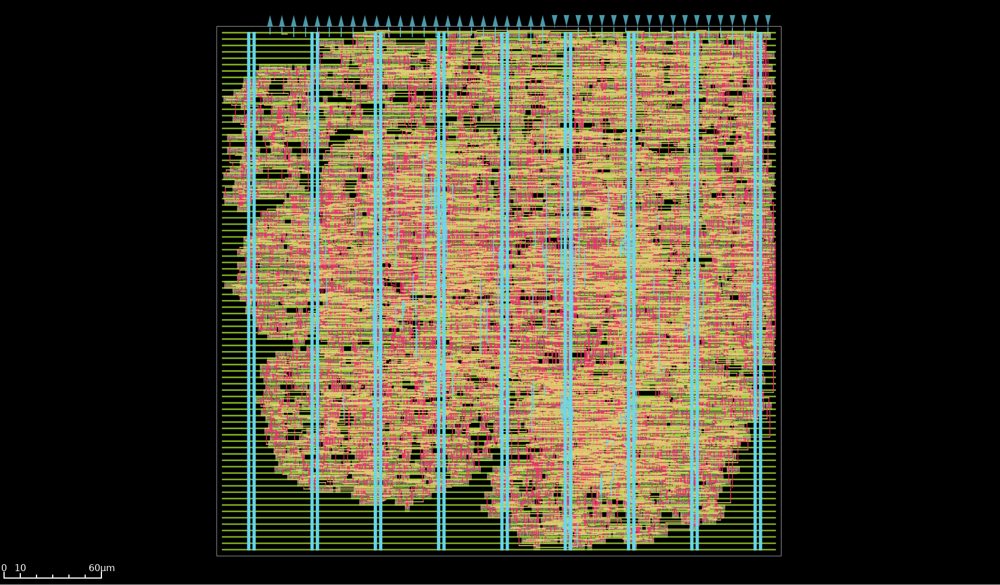

# Multiply and accumulate matrix multiplier ASIC with design for test infrastructure

ASIC design for a 2x2 systolic matrix multiplier on GF180 supporting multiply and accumulate operations on int8 data alongside a design for test infrastructure to help debug both usage and diagnose design issues in silicon.



Documentation on using this accelerator can be found : [here](docs/info.md)

# ASIC 

This accelerator was designed for the GF180nm node using the gf180mcuD PDK. It occupies 1,127.83 µm² of die area and has a target typical operating voltage of 3.3V at 25°C.

This design features two clock trees, one for the MAC and another for the JTAG TAP. The MAC clock targets a 50 MHz operating frequency, and the JTAG 2 MHz.

There are currently no known manufacturability issues.

Current status: taped-in, in fabrication

# MAC 

This design features 4 MAC units performing a fused multiply and add operation (FMA) on 8-bit signed integers.

This entire operation is computed in a single cycle at 50 MHz and a single rounding operation to fit into the 8-bit signed integer range is performed on the final operation's results.

## Frequency 

The 50 MHz speed was chosen according to the maximum estimated reliable IO switching frequency, and going above this would not have resulted in any additional speedup given the IO data transfer and on-chip storage bottlenecks.

## Multiplication

Each unit implements a Booth radix-4 multiplier. This multiplier design was chosen for its low logic depth and reasonable area cost. Additionally, since we are doing signed multiplication, we can remove a level in the Wallace tree we are using for the partial product additions given we only have 4 partial products, unlike the 5 needed for unsigned operations.  

## Data access

This design stores a single 8-bit signed weight internally per MAC unit. The remainder of the input data must be circulated through the input parallel port on every use, making IO this design's biggest bottleneck for this first generation.

This tradeoff was made because weights exhibit higher temporal and spatial locality than input data. In typical usage, each MAC unit will reuse the same weight value multiple times across different computations, and these weights often remain constant across multiple input matrices.

# DFT 

This design embeds a JTAG for debugging the accelerator's usage by probing into internal registers and helping identify PCB issues using a boundary scan.

This JTAG TAP was designed to operate at `2 MHz`, has idcode `0x1beef0d7`.

Its instruction register length is `3`, and implements the following instructions:

| Instruction | Opcode | Description |
|---|---|---|
| `EXTEST` | `0x0` | Boundary scan |
| `IDCODE` | `0x1` | Reads JTAG TAP identifier |
| `SAMPLE_PRELOAD` | `0x2` | Boundary scan |
| `USER_REG` | `0x3` | Probe internal registers |
| `BYPASS` | `0x7` | Set the TAP in bypass mode |

All four standard instructions `EXTEST`, `IDCODE`, `SAMPLE_PRELOAD`, `BYPASS` conform to the standard behavior.

## `USER_REG`

The `USER_REG` state was designed to probe into the data currently used by each of the 4 MAC units.
The data to be read is specified by loading its address in the data register during a previous `DR_SHIFT` stage. As such, two sequences of `DR_SHIFTS` might be necessary:
1. Load the address of the next data
2. Read the data off TDI

The address and data are both `8` bits wide, though only the bottom 4 bits of the address are used.

### Address format
The address uses the following format:
```
[ unused 7:4 ][ mac unit 3:2 ][ register id 1:0 ] 
```
Register id mapping for this MAC unit gives us the current:

| Register ID | Description |
|---|---|
| `0x0` | Weight (multiplier) |
| `0x1` | Multiplicand (circulated data) |
| `0x2` | Summand (circulated data) |
| `0x3` | MAC operation overflow bits, used in rounding to the maximum representation range of the `int8_t`, discarded before the next MAC unit (internal MAC unit data) |

## Important considerations for usage 

When using the USER_REG custom JTAG TAP instruction, the MAC logic is expected to be temporarily halted, as in no weight or data update operations and no matrix compute is expected to be ongoing.
To this effect, there is no CDC protection when transferring data between the JTAG clock domain and the MAC domain. If the MAC isn't halted, the resulting metastability risks corrupting the sampled data.

This also applies when doing a boundary scan.

## Quickstart

For quickly getting started, use the utilities provided in `jtag/openocd.cfg`.

Given this default config assumes you are using a `jlink`, and this might not be the adapter you are using, you may need to update the adapter sourcing your current probe:
```
source [find interface/jlink.cfg]
```

### Usage 
Run using : 
```
openocd -f jtag/openocd.cfg
```

Expected output:
```
Open On-Chip Debugger 0.12.0+dev-02171-g11dc2a288 (2025-11-23-19:25)
Licensed under GNU GPL v2
For bug reports, read
	http://openocd.org/doc/doxygen/bugs.html
Info : J-Link V10 compiled Jan 30 2023 11:28:07
Info : Hardware version: 10.10
Info : VTarget = 3.380 V
Info : clock speed 2000 kHz
Info : JTAG tap: tpu.tap tap/device found: 0x1beef0d7 (mfg: 0x06b (Transwitch), part: 0xbeef, ver: 0x1)
Warn : gdb services need one or more targets defined
idcode : 1beef0d7
read internal register 0:0 : 0x00 - weight
read internal register 0:1 : 0x00 - multiplicand ( input data )
read internal register 0:2 : 0x00 - summand ( input data )
...
```

# Future improvements 

This design was the first iteration for a MAC systolic accelerator. Here are a few paths I have identified for future improvements:
- Explore floating-point arithmetic
- Integrate on-chip SRAM to reduce input data bottleneck
- More directed MAC unit physical layout, with particular attention given to adder tree implementations; experiment with full adder cells
- Add support for detecting manufacturing faults in silicon and integrate an ATPG flow into future workflows
