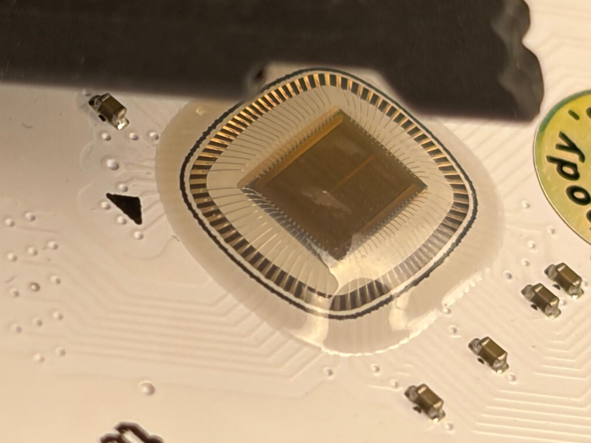
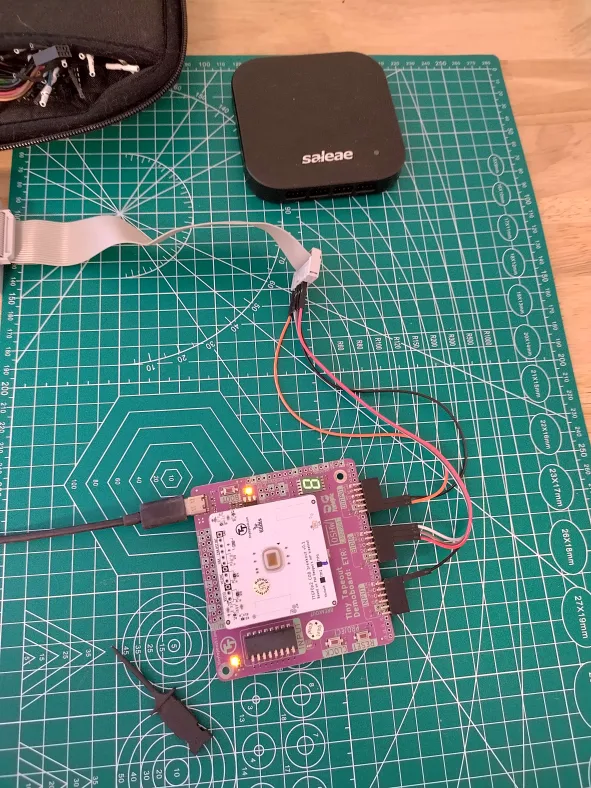
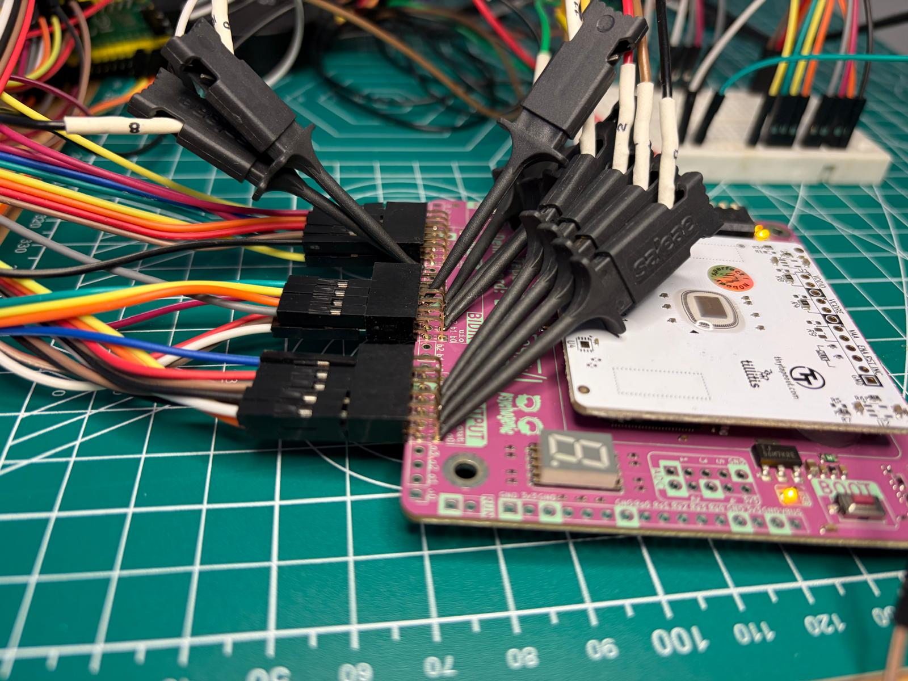
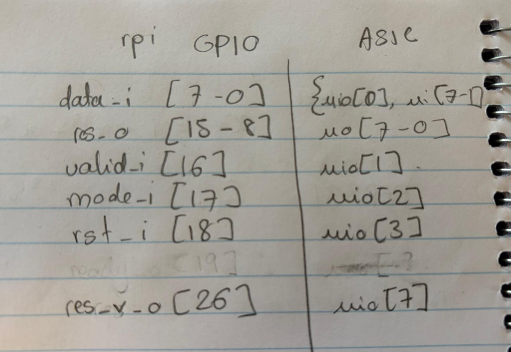
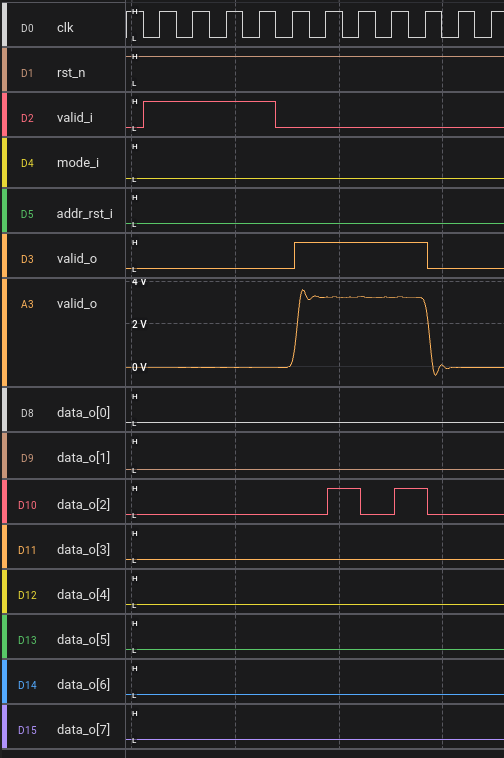

# Silicon bringup 

Status: **A0 WORKS!**

 

## JTAG



Status: WORKING! 

Features tested: 
- [x] `IDCODE` - working
- [x] `USER_REG` reading internal MAC registers - working
- [x] `SAMPLE_REPLOAD` reading boudary scan registers, all input pins tested - working
- [x] `SAMPLE_REPLOAD` reading boudary scan registers, all output pins tested - working
- [x] `EXTEST` writing boudary scan registers, all output pins tested

Running jtag test script using openOCD: 
```
openocd -f openocd.cfg
```

Output: 
```		
[pitchu](master) ~/rtl/mac_dft/jtag >openocd -f openocd.cfg
Open On-Chip Debugger 0.12.0+dev-02429-ge4c49d860 (2026-03-17-19:44)
Licensed under GNU GPL v2
For bug reports, read
	http://openocd.org/doc/doxygen/bugs.html
Info : J-Link V10 compiled Jan 30 2023 11:28:07
Info : Hardware version: 10.10
Info : VTarget = 3.303 V
Info : clock speed 2000 kHz
Info : JTAG tap: tpu.tap tap/device found: 0x1beef0d7 (mfg: 0x06b (Transwitch), part: 0xbeef, ver: 0x1)
Warn : gdb services need one or more targets defined
idcode : 1beef0d7
read internal register 0:0 : 0xf1 - weight
read internal register 0:1 : 0xf9 - multiplicant ( input data )
read internal register 0:2 : 0x00 - summand ( input data )
read internal register 0:3 : 0x00 - operation overflow bits
read internal register 1:0 : 0x8a - weight
read internal register 1:1 : 0x00 - multiplicant ( input data )
read internal register 1:2 : 0x00 - summand ( input data )
read internal register 1:3 : 0x00 - operation overflow bits
read internal register 2:0 : 0x27 - weight
read internal register 2:1 : 0x25 - multiplicant ( input data )
read internal register 2:2 : 0x5f - summand ( input data )
read internal register 2:3 : 0x06 - operation overflow bits
read internal register 3:0 : 0x78 - weight
read internal register 3:1 : 0x81 - multiplicant ( input data )
read internal register 3:2 : 0x7f - summand ( input data )
read internal register 3:3 : 0xc4 - operation overflow bits
Info : Listening on port 6666 for tcl connections
Info : Listening on port 4444 for telnet connections
```

### Boundary scan topology 

 

You can read from the input pin values using the internal scan chain using the `SAMPLE_PRELOAD` instruction and 
write to the output pins using and internal logic using the `EXTEST` instruction. 

## Systolic Array 


Because we need more probes : 



### Setup TT daughter board 

To configure TT mux, after plugging in the daughter board : 
```
make flash
```

Open TTY on board: 
```
make picocom
```

Setup project: 
```
import tt_um_essen_test
tt = tt_um_essen_test.enable_essen()
```

You want to be extra sure `rst_n` is pulled high and `tt.mode` is set to `ASIC_MANUAL_INPUTS`: 
```
tt.reset_project(False)
from ttboard.demoboard import RPMode
tt.mode = RPMode.ASIC_MANUAL_INPUTS
```
### Connect external rpi 

We will be driving this ASIC over Pmod from an external rp2040 board, wiring as follows: 



Firmware is in the `firmware` folder. 

### ASIC in action 

Example of ASIC in action:

We are using the 2x2 matrix for data and weights `{0,2,0,2}`.

We can confirm the weights that are written internally in the ASIC by probing over JTAG: 
```
read internal register 0:0 : 0x00 - weight                            <--- 0
read internal register 0:1 : 0x02 - multiplicant ( input data )
read internal register 0:2 : 0x00 - summand ( input data )
read internal register 0:3 : 0x00 - operation overflow bits
read internal register 1:0 : 0x02 - weight                             <--- 2
read internal register 1:1 : 0x00 - multiplicant ( input data )
read internal register 1:2 : 0x00 - summand ( input data )
read internal register 1:3 : 0x00 - operation overflow bits
read internal register 2:0 : 0x00 - weight                             <--- 0
read internal register 2:1 : 0x02 - multiplicant ( input data )
read internal register 2:2 : 0x00 - summand ( input data )
read internal register 2:3 : 0x00 - operation overflow bits
read internal register 3:0 : 0x02 - weight                             <--- 2
read internal register 3:1 : 0x02 - multiplicant ( input data )
read internal register 3:2 : 0x00 - summand ( input data )
read internal register 3:3 : 0x00 - operation overflow bits
```

Looking at the results sent over the wire, we read the correctly expected `{0,4,0,4}`.


